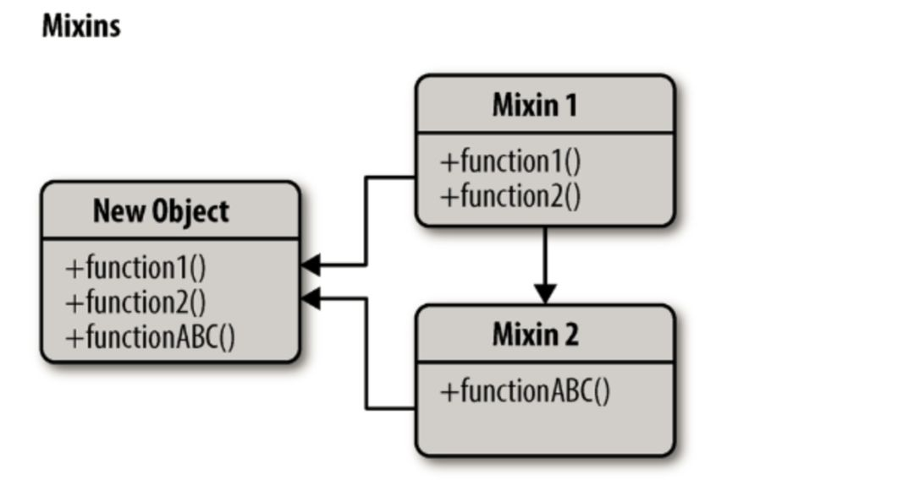

页面和组件变得越来越复杂，如何更好的实现状态逻辑复用一直都是应用程序中重要的一部分，这直接关系着应用程序的质量以及维护的难易程度。下面从三种不同的技术来实现react组件代码的复用。

## Mixin设计模式



Mixin（混入）是一种通过扩展收集功能的方式，它本质上是将一个对象的属性拷贝到另一个对象上面去，不过你可以拷贝任意多个对象的任意个方法到一个新对象上去，这是继承所不能实现的。它的出现主要就是为了解决代码复用问题。

很多开源库提供了Mixin的实现，如Underscore的_.extend方法、JQuery的extend方法。

使用_.extend方法实现代码复用：

``` js
var LogMixin = {
  actionLog: function() {
    console.log('action...');
  },
  requestLog: function() {
    console.log('request...');
  },
};
function User() {  /*..*/  }
function Goods() {  /*..*/ }
_.extend(User.prototype, LogMixin);
_.extend(Goods.prototype, LogMixin);
var user = new User();
var good = new Goods();
user.actionLog();
good.requestLog();
```

手动写一个简单的Mixin方法：

``` js
function setMixin(target, mixin){
    if(arguments[2]){
        for (var i = 2, len = arguments.length; i < len; i++) {
            target.prototype[arguments[i]] = mixin[arguments[i]];
        }
    }else{
        for(var methodName in mixin.prototype){
            if(!Object.hasOwnProperty(target.prototype, methodName)){
                target.prototype[methodName] = mixin[methodName]
            }
        }
    }
}
setMixin(User,LogMixin,'actionLog');
setMixin(Goods,LogMixin,'requestLog');
```

React中应用Mixin

React也提供了Mixin的实现，如果完全不同的组件有相似的功能，我们可以引入来实现代码复用，当然只有在使用createClass来创建React组件时才可以使用，因为在React组件的es6写法中它已经被废弃掉了。

例如下面的例子，很多组件或页面都需要记录用户行为，性能指标等。如果我们在每个组件都引入写日志的逻辑，会产生大量重复代码，通过Mixin我们可以解决这一问题：

``` jsx
var LogMixin = {
  log: function() {
    console.log('log');
  },
  componentDidMount: function() {
    console.log('in');
  },
  componentWillUnmount: function() {
    console.log('out');
  }
};

var User = React.createClass({
  mixins: [LogMixin],
  render: function() {
    return (<div>...</div>)
  }
});

var Goods = React.createClass({
  mixins: [LogMixin],
  render: function() {
    return (<div>...</div>)
  }
});

```

### Mixin带来的危害

React官方文档在Mixins Considered Harmful一文中提到了Mixin带来了危害：

* Mixin 可能会相互依赖，相互耦合，不利于代码维护
* 不同的 Mixin 中的方法可能会相互冲突
* Mixin非常多时，组件是可以感知到的，甚至还要为其做相关处理，这样会给代码造成滚雪球式的复杂性

React现在已经不再推荐使用Mixin来解决代码复用问题，因为Mixin带来的危害比他产生的价值还要巨大，并且React全面推荐使用高阶组件来替代它。另外，高阶组件还能实现更多其他更强大的功能，在学习高阶组件之前，我们先来看一个设计模式。


## 装饰模式

装饰者(decorator)模式能够在不改变对象自身的基础上，在程序运行期间给对像动态的添加职责。与继承相比，装饰者是一种更轻便灵活的做法。

### 高阶组件（HOC）

高阶组件可以看作React对装饰模式的一种实现，高阶组件就是一个函数，且该函数接受一个组件作为参数，并返回一个新的组件。

>高阶组件（HOC）是React中的高级技术，用来重用组件逻辑。但高阶组件本身并不是React API。它只是一种模式，这种模式是由React自身的组合性质必然产生的。

``` js
function visible(WrappedComponent) {
  return class extends Component {
    render() {
      const { visible, ...props } = this.props;
      if (visible === false) return null;
      return <WrappedComponent {...props} />;
    }
  }
}
```

上面的代码就是一个HOC的简单应用，函数接收一个组件作为参数，并返回一个新组件，新组建可以接收一个visible props，根据visible的值来判断是否渲染Visible。

下面我们从以下几方面来具体探索HOC。

### HOC的实现方式

#### 属性代理

函数返回一个我们自己定义的组件，然后在render中返回要包裹的组件，这样我们就可以代理所有传入的props，并且决定如何渲染，实际上 ，这种方式生成的高阶组件就是原组件的父组件，上面的函数visible就是一个HOC属性代理的实现方式。

``` js
function proxyHOC(WrappedComponent) {
  return class extends Component {
    render() {
      return <WrappedComponent {...this.props} />;
    }
  }
}
```

对比原生组件增强的项：
* 可操作所有传入的props
* 可操作组件的生命周期
* 可操作组件的static方法
* 获取refs

#### 反向继承

返回一个组件，继承原组件，在render中调用原组件的render。由于继承了原组件，能通过this访问到原组件的生命周期、props、state、render等，相比属性代理它能操作更多的属性。

``` js
function inheritHOC(WrappedComponent) {
  return class extends WrappedComponent {
    render() {
      return super.render();
    }
  }
}
```

对比原生组件增强的项：

* 可操作所有传入的props
* 可操作组件的生命周期
* 可操作组件的static方法
* 获取refs
* 可操作state
* 可以渲染劫持

### HOC可以实现什么功能

#### 组合渲染

可使用任何其他组件和原组件进行组合渲染，达到样式、布局复用等效果。

通过属性代理实现:
``` jsx
function stylHOC(WrappedComponent) {
  return class extends Component {
    render() {
      return (<div>
        <div className="title">{this.props.title}</div>
        <WrappedComponent {...this.props} />
      </div>);
    }
  }
}
```
通过反向继承实现:
``` js
function styleHOC(WrappedComponent) {
  return class extends WrappedComponent {
    render() {
      return <div>
        <div className="title">{this.props.title}</div>
        {super.render()}
      </div>
    }
  }
}
```

#### 条件渲染

根据特定的属性决定原组件是否渲染

通过属性代理实现:
``` js
function visibleHOC(WrappedComponent) {
  return class extends Component {
    render() {
      if (this.props.visible === false) return null;
      return <WrappedComponent {...props} />;
    }
  }
}
```
通过反向继承实现: 
``` js
function visibleHOC(WrappedComponent) {
  return class extends WrappedComponent {
    render() {
      if (this.props.visible === false) {
        return null
      } else {
        return super.render()
      }
    }
  }
}
```

#### 操作props

可以对传入组件的props进行增加、修改、删除或者根据特定的props进行特殊的操作。

通过属性代理实现:
``` js
function proxyHOC(WrappedComponent) {
  return class extends Component {
    render() {
      const newProps = {
        ...this.props,
        user: 'ConardLi'
      }
      return <WrappedComponent {...newProps} />;
    }
  }
}
```

#### 获取refs

高阶组件中可获取原组件的ref，通过ref获取组件实力，如下面的代码，当程序初始化完成后调用原组件的log方法。(不知道refs怎么用，请👇Refs & DOM)

通过属性代理实现:
``` js
function refHOC(WrappedComponent) {
  return class extends Component {
    componentDidMount() {
      this.wapperRef.log()
    }
    render() {
      return <WrappedComponent {...this.props} ref={ref => { this.wapperRef = ref }} />;
    }
  }
}
```
>这里注意：调用高阶组件的时候并不能获取到原组件的真实ref，需要手动进行传递，具体请看传递refs


#### 状态管理

将原组件的状态提取到HOC中进行管理，如下面的代码，我们将Input的value提取到HOC中进行管理，使它变成受控组件，同时不影响它使用onChange方法进行一些其他操作。基于这种方式，我们可以实现一个简单的双向绑定，具体请看双向绑定。

通过属性代理实现:
```js
function proxyHoc(WrappedComponent) {
  return class extends Component {
    constructor(props) {
      super(props);
      this.state = { value: '' };
    }

    onChange = (event) => {
      const { onChange } = this.props;
      this.setState({
        value: event.target.value,
      }, () => {
        if(typeof onChange ==='function'){
          onChange(event);
        }
      })
    }

    render() {
      const newProps = {
        value: this.state.value,
        onChange: this.onChange,
      }
      return <WrappedComponent {...this.props} {...newProps} />;
    }
  }
}

class HOC extends Component {
  render() {
    return <input {...this.props}></input>
  }
}

export default proxyHoc(HOC);
```
#### 操作state

上面的例子通过属性代理利用HOC的state对原组件进行了一定的增强，但并不能直接控制原组件的state，而通过反向继承，我们可以直接操作原组件的state。但是并不推荐直接修改或添加原组件的state，因为这样有可能和组件内部的操作构成冲突。

通过反向继承实现:

``` js
function debugHOC(WrappedComponent) {
  return class extends WrappedComponent {
    render() {
      console.log('props', this.props);
      console.log('state', this.state);
      return (
        <div className="debuging">
          {super.render()}
        </div>
      )
    }
  }
}
```

上面的HOC在render中将props和state打印出来，可以用作调试阶段，当然你可以在里面写更多的调试代码。想象一下，只需要在我们想要调试的组件上加上@debug就可以对该组件进行调试，而不需要在每次调试的时候写很多冗余代码。(如果你还不知道怎么使用HOC，请👇如何使用HOC)

### 渲染劫持

高阶组件可以在render函数中做非常多的操作，从而控制原组件的渲染输出。只要改变了原组件的渲染，我们都将它称之为一种渲染劫持。

实际上，上面的组合渲染和条件渲染都是渲染劫持的一种，通过反向继承，不仅可以实现以上两点，还可直接增强由原组件render函数产生的React元素。

通过反向继承实现
``` js
function hijackHOC(WrappedComponent) {
  return class extends WrappedComponent {
    render() {
      const tree = super.render();
      let newProps = {};
      if (tree && tree.type === 'input') {
        newProps = { value: '渲染被劫持了' };
      }
      const props = Object.assign({}, tree.props, newProps);
      const newTree = React.cloneElement(tree, props, tree.props.children);
      return newTree;
    }
  }
}
```
>注意上面的说明我用的是增强而不是更改。render函数内实际上是调用React.creatElement产生的React元素：

不能直接修改，我们可以借助cloneElement方法来在原组件的基础上增强一个新组件：

>React.cloneElement()克隆并返回一个新的React元素，使用 element 作为起点。生成的元素将会拥有原始元素props与新props的浅合并。新的子级会替换现有的子级。来自原始元素的 key 和 ref 将会保留。

React.cloneElement() 几乎相当于：
``` jsx
<element.type {...element.props} {...props}>{children}</element.type>
```

## 如何使用HOC

上面的示例代码都写的是如何声明一个HOC，HOC实际上是一个函数，所以我们将要增强的组件作为参数调用HOC函数，得到增强后的组件。

``` js
class myComponent extends Component {
  render() {
    return (<span>原组件</span>)
  }
}
export default inheritHOC(myComponent);
```

### compose

在实际应用中，一个组件可能被多个HOC增强，我们使用的是被所有的HOC增强后的组件，借用一张装饰模式的图来说明，可能更容易理解：


``` js
logger(visible(style(Input)))
```

这种代码非常的难以阅读，我们可以手动封装一个简单的函数组合工具，将写法改写如下：
``` js
const compose = (...fns) => fns.reduce((f, g) => (...args) => g(f(...args)));
compose(logger,visible,style)(Input);
```
compose函数返回一个所有函数组合后的函数，compose(f, g, h) 和 (…args) => f(g(h(…args)))是一样的。

很多第三方库都提供了类似compose的函数，例如lodash.flowRight，Redux提供的combineReducers函数等。

### Decorators

我们还可以借助ES7为我们提供的Decorators来让我们的写法变的更加优雅：

``` js
@logger
@visible
@style
class Input extends Component {
  // ...
}
```

还可以结合上面的compose函数使用：

``` js
const hoc = compose(logger, visible, style);
@hoc
class Input extends Component {
  // ...
}
```

### HOC的实际应用

下面是一些我在生产环境中实际对HOC的实际应用场景，由于文章篇幅原因，代码经过很多简化，如有问题欢迎在评论区指出：